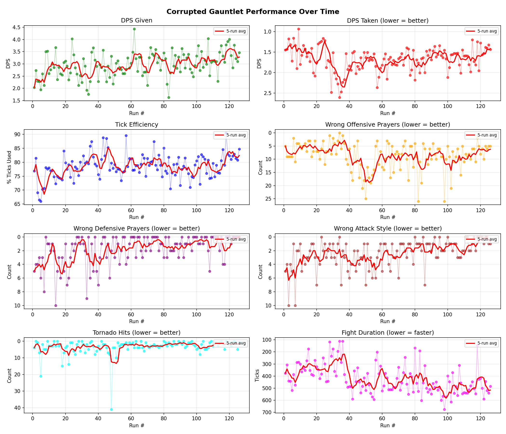
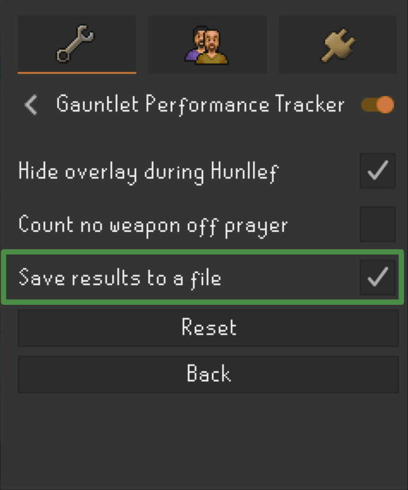

# Gauntlet Performance Plotter

A Python tool to visualize your Corrupted Gauntlet performance over time using data from the [RuneLite Gauntlet Performance Tracker plugin](https://runelite.net/plugin-hub/show/gauntlet-performance-tracker).



## Features

- Auto-detects RuneLite data directory
- Supports multiple accounts
- Tracks 8 performance metrics over time
- Shows 5-run moving average trend lines
- Filters out incomplete runs (configurable threshold)

## Metrics Tracked

| Metric | Goal |
|--------|------|
| DPS Given | Higher = better |
| DPS Taken | Lower = better |
| Tick Efficiency | Higher = better |
| Wrong Offensive Prayers | Lower = better |
| Wrong Defensive Prayers | Lower = better |
| Wrong Attack Style | Lower = better |
| Tornado Hits | Lower = better |
| Fight Duration | Lower = faster |

## Requirements

- Python 3.7+
- matplotlib
- [Gauntlet Performance Tracker](https://runelite.net/plugin-hub/show/gauntlet-performance-tracker) RuneLite plugin

## Plugin Setup

Enable **"Save results to a file"** in the plugin settings:



## Installation

```bash
git clone https://github.com/YOUR_USERNAME/gauntlet-performance-plotter.git
cd gauntlet-performance-plotter
pip install -r requirements.txt
```

## Usage

```bash
python gauntlet_plotter.py
```

The script will:
1. Find your RuneLite gauntlet tracker data
2. List available accounts (if multiple)
3. Display a performance chart

## Configuration

Edit `gauntlet_plotter.py` to adjust:

```python
MIN_TICKS = 100  # Minimum fight duration to count as a real run
```

The `MIN_TICKS` filter excludes incomplete runs where you died early or teleported out. A typical Corrupted Hunllef kill takes 200-350 ticks (~2-3.5 minutes), so runs under 100 ticks are almost certainly failed attempts that would skew your stats.

## Data Location

The script looks for data in:
- **Linux/Mac**: `~/.runelite/gauntletPerformanceTracker/data/`
- **Windows**: `%LOCALAPPDATA%/RuneLite/gauntletPerformanceTracker/data/`

## License

MIT
